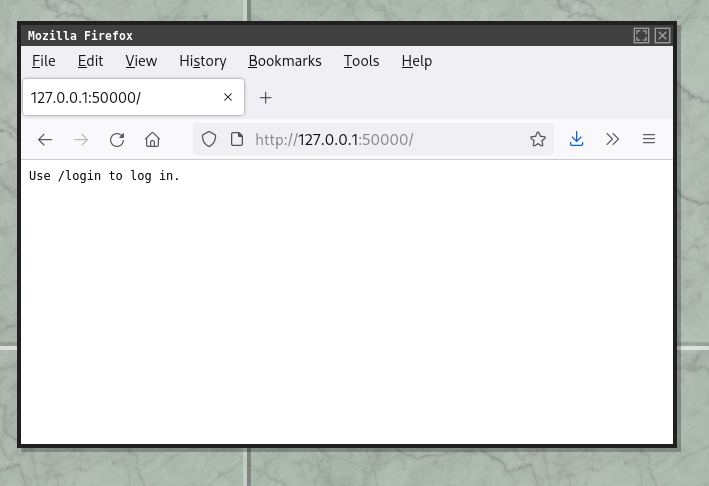
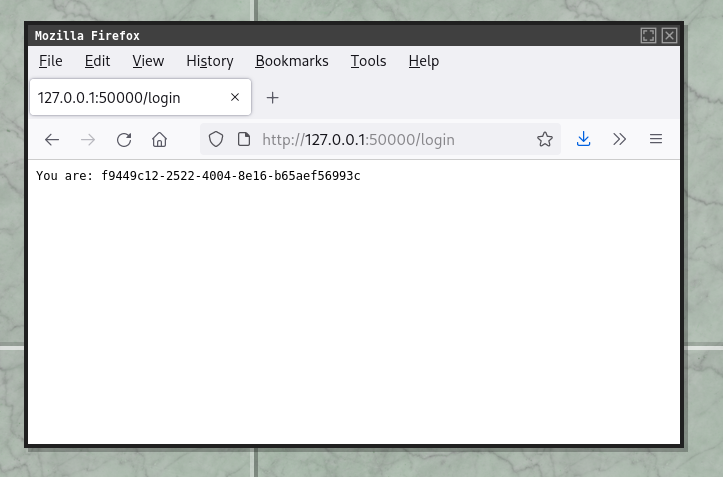
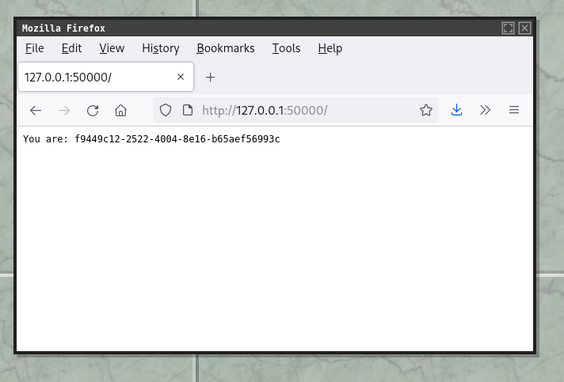
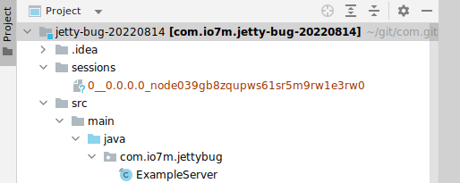
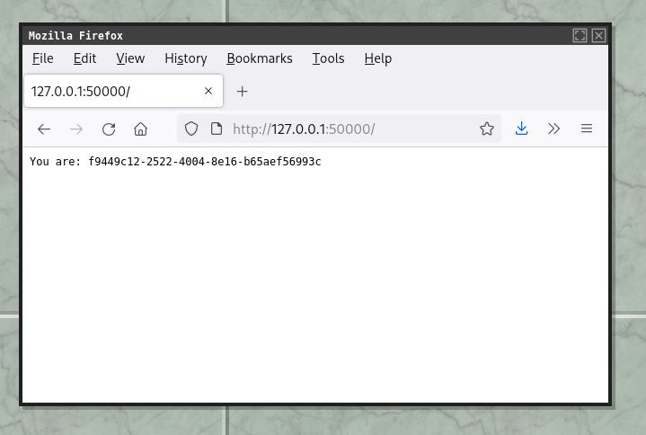
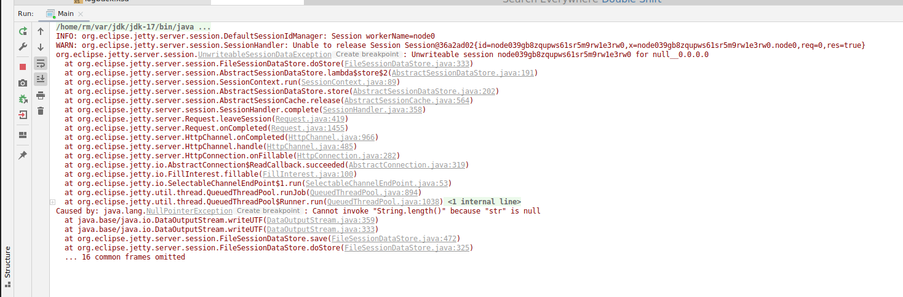
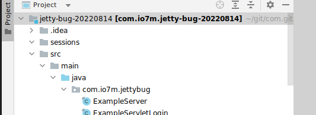
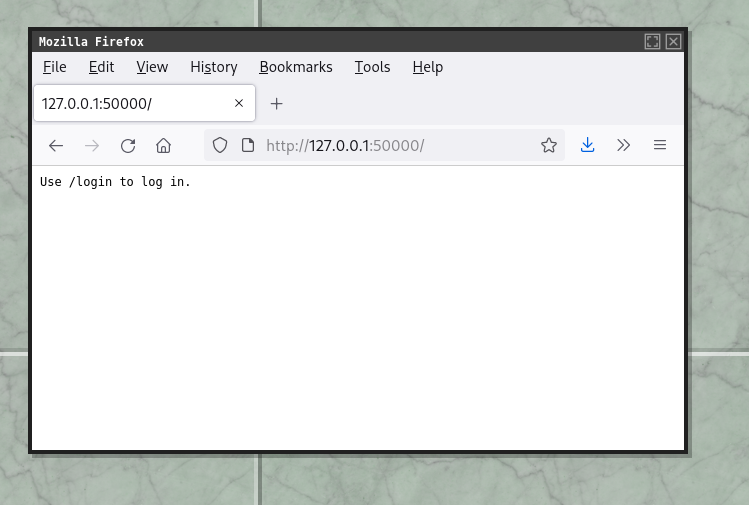

# jetty-bug-20220814

1. Start the server. Navigate to `http://localhost:50000`. The server correctly tells the user they aren't logged in:

2. Navigate to `http://localhost:50000/login`. The user is assigned  a random user ID and a session is created:

3. Navigating back to the main page shows the session works:

4. The sessions directory contains a file:

5. Stop the server.
6. Start the server.

7. The session still works:

... but the server is logging errors on every page refresh:

... and the session directory is empty:

8. Stop the server.
9. Start the server.

10. The session is gone:

